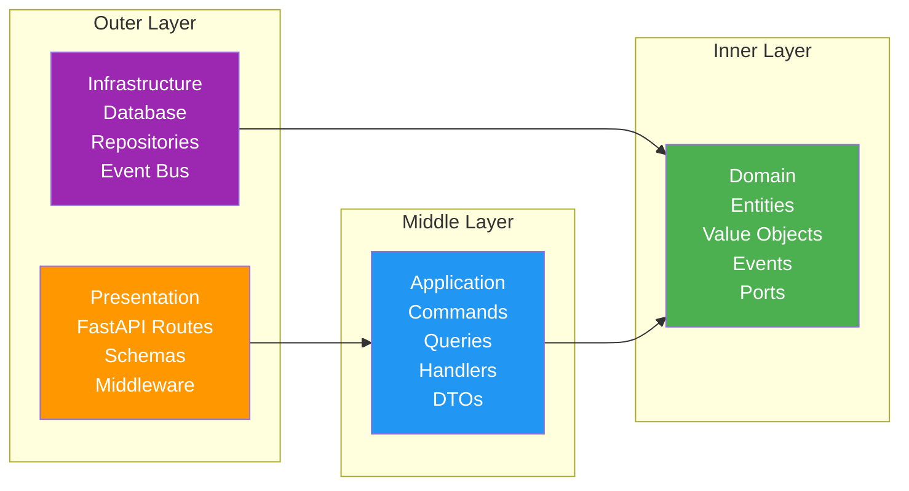
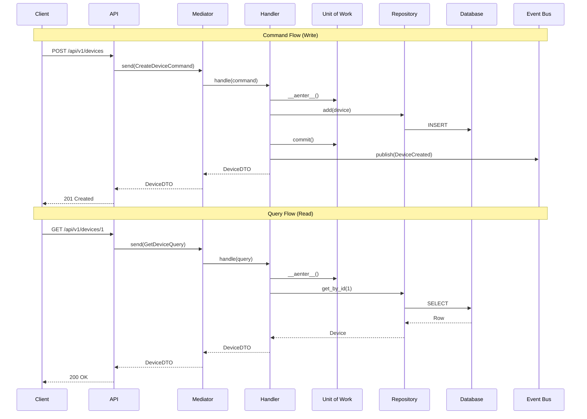
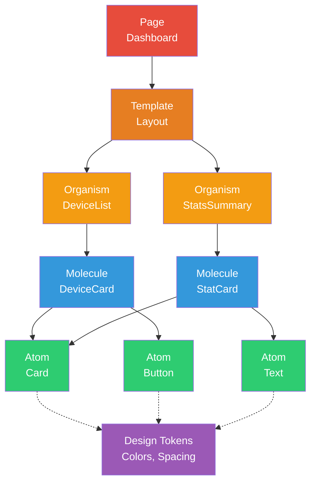
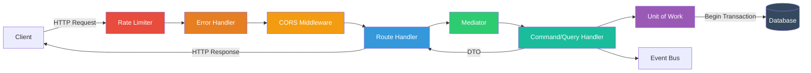
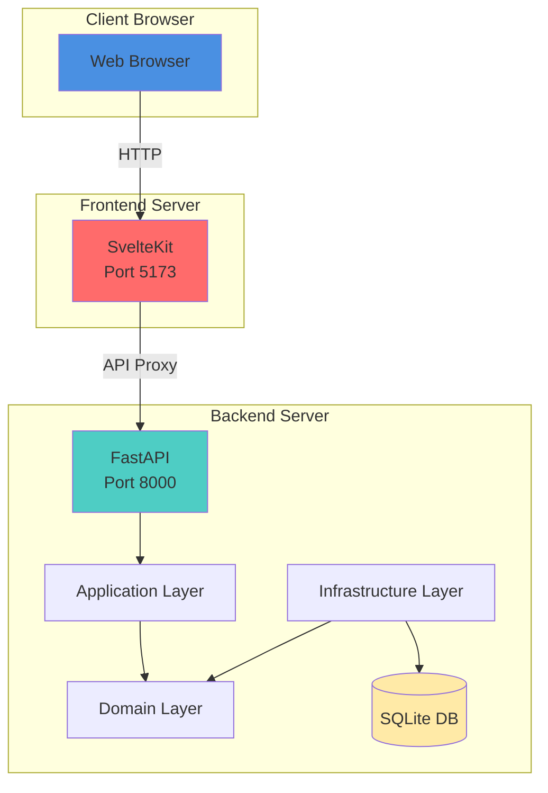

# Architecture Diagrams

## System Architecture

```mermaid
graph TB
    subgraph "Frontend (Svelte)"
        UI[User Interface]
        Pages[Pages/Routes]
        Organisms[Organisms]
        Molecules[Molecules]
        Atoms[Atoms]
        API[API Client]
        
        UI --> Pages
        Pages --> Organisms
        Organisms --> Molecules
        Molecules --> Atoms
        Pages --> API
    end
    
    subgraph "Backend (FastAPI)"
        Router[API Routes]
        Middleware[Middleware]
        Mediator[Mediator]
        
        subgraph "Application Layer"
            Commands[Commands]
            Queries[Queries]
            Handlers[Handlers]
            DTOs[DTOs]
        end
        
        subgraph "Domain Layer"
            Entities[Entities]
            ValueObjects[Value Objects]
            Events[Domain Events]
            Ports[Ports/Interfaces]
            Factories[Factories]
            Strategies[Strategies]
        end
        
        subgraph "Infrastructure Layer"
            Repositories[Repositories]
            UnitOfWork[Unit of Work]
            Database[Database]
            EventBus[Event Bus]
            CircuitBreaker[Circuit Breaker]
        end
        
        Router --> Middleware
        Middleware --> Mediator
        Mediator --> Handlers
        Handlers --> Commands
        Handlers --> Queries
        Handlers --> DTOs
        Handlers --> UnitOfWork
        Handlers --> EventBus
        
        UnitOfWork --> Repositories
        Repositories --> Database
        
        Handlers ..-> Ports
        Repositories ..|> Ports
        
        Factories --> Entities
        Factories --> ValueObjects
        Handlers --> Factories
        
        Events --> EventBus
        Entities --> Events
    end
    
    API -.->|HTTP/JSON| Router
    Database[(SQLite)]
    
    style "Domain Layer" fill:#e1f5ff
    style "Application Layer" fill:#fff4e1
    style "Infrastructure Layer" fill:#f0f0f0
    style "Frontend (Svelte)" fill:#ffe1e1
```

## Clean Architecture Layers



## CQRS Flow



## Component Dependencies

```mermaid
graph TD
    Routes[API Routes] --> Mediator
    Mediator --> CommandHandler[Command Handler]
    Mediator --> QueryHandler[Query Handler]
    
    CommandHandler --> UoW[Unit of Work]
    QueryHandler --> UoW
    CommandHandler --> EventBus[Event Bus]
    
    UoW --> DeviceRepo[Device Repository]
    UoW --> ConsumptionRepo[Consumption Repository]
    UoW --> ScheduleRepo[Schedule Repository]
    UoW --> BudgetRepo[Budget Repository]
    
    DeviceRepo --> DB[(Database)]
    ConsumptionRepo --> DB
    ScheduleRepo --> DB
    BudgetRepo --> DB
    
    CommandHandler --> Factory[Entity Factory]
    Factory --> Entity[Domain Entity]
    
    Entity --> ValueObject[Value Object]
    Entity --> DomainEvent[Domain Event]
    
    DomainEvent --> EventBus
    
    CommandHandler ..-> Port[Repository Port]
    DeviceRepo ..|> Port
    
    style Routes fill:#FF6B6B
    style Mediator fill:#4ECDC4
    style CommandHandler fill:#45B7D1
    style QueryHandler fill:#45B7D1
    style UoW fill:#96CEB4
    style DB fill:#FFEAA7
    style Entity fill:#DFE6E9
    style Port fill:#A29BFE
```

## Atomic Design Structure



## API Request Flow



## Deployment Architecture


